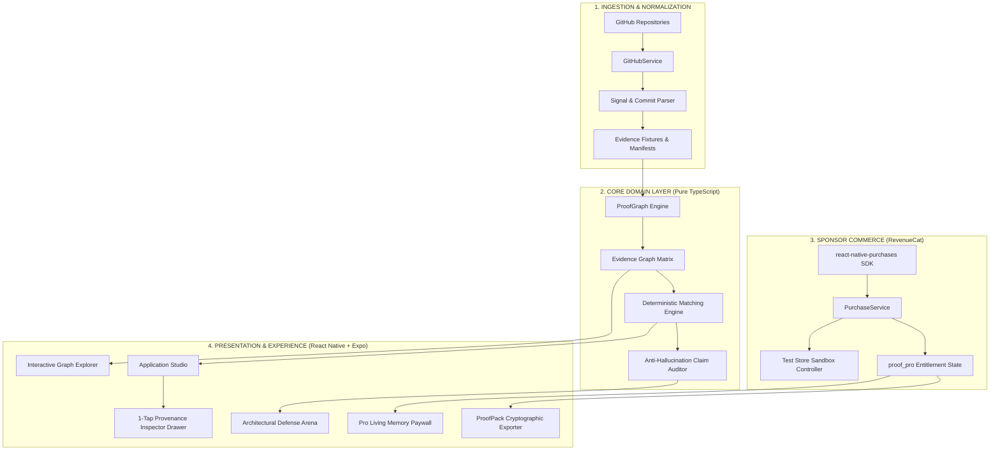

# ⚡ EVIDENT — Code-Grounded Career Intelligence Engine

<div align="center">

[](https://devpost.com)
[](https://github.com/nika619/Evident--the-ultimate-help-)
[](https://www.typescriptlang.org/)
[](https://expo.dev/)
[](./LICENSE)

<br/>

> *"Your resume should describe what you can prove. Evident remembers what you have done. Apply knows when it matters."*  
> **Brand Thesis:** **Don't Claim It. Prove It.**

</div>

---

## 📑 Table of Contents

- [1. Executive Summary \& The Industry Crisis](#1-executive-summary--the-industry-crisis)
- [2. The 5-Dimensional Evidence Model](#2-the-5-dimensional-evidence-model)
- [3. End-to-End System Architecture](#3-end-to-end-system-architecture)
- [4. Core Functional Subsystems](#4-core-functional-subsystems)
  - [4.1 Living Evidence \& Relational Graph Explorer](#41-living-evidence--relational-graph-explorer)
  - [4.2 Deterministic Opportunity Matching Engine](#42-deterministic-opportunity-matching-engine)
  - [4.3 Application Studio \& The 1-Tap Provenance Inspector (The Hero)](#43-application-studio--the-1-tap-provenance-inspector-the-hero)
  - [4.4 Architectural Defense Arena](#44-architectural-defense-arena)
  - [4.5 ProofPack™ Cryptographic Export System](#45-proofpack-cryptographic-export-system)
  - [4.6 Guided Interactive Onboarding \& Tutorial](#46-guided-interactive-onboarding--tutorial)
- [5. Deep RevenueCat Integration (Sponsor Showcase)](#5-deep-revenuecat-integration-sponsor-showcase)
  - [5.1 The Living Career Memory Entitlement (`proof_pro`)](#51-the-living-career-memory-entitlement-proof_pro)
  - [5.2 Tier Packaging \& Pricing Strategy](#52-tier-packaging--pricing-strategy)
  - [5.3 RevenueCat Test Store \& Judge Sandbox Architecture](#53-revenuecat-test-store--judge-sandbox-architecture)
- [6. Software Craftsmanship \& Clean Architecture](#6-software-craftsmanship--clean-architecture)
- [7. Mathematical Formulation: Transparent Matching](#7-mathematical-formulation-transparent-matching)
- [8. Test Suite \& Formal Verification (29/29 Passing)](#8-test-suite--formal-verification-2929-passing)
- [9. Annotated Codebase Directory Tree](#9-annotated-codebase-directory-tree)
- [10. Quick Start \& Local Execution](#10-quick-start--local-execution)
- [11. Devpost Judges Evaluation Guide](#11-devpost-judges-evaluation-guide)
- [12. Open Source License](#12-open-source-license)

---

## 1. Executive Summary & The Industry Crisis

The tech recruitment landscape is suffering from a catastrophic **Trust Deficit**:

1. **The Generative AI Slop Dilemma:** Candidates copy-paste job postings into generic LLMs, yielding hallucinated resumes loaded with buzzwords (*"Architected distributed, fault-tolerant cloud microservices"*). Recruiters, having caught on, discount resumes with deep cynicism.
2. **The Absence-of-Evidence Problem:** Early-career engineers and students do not lack work — they lack **verifiable provenance**. They have hundreds of commits, hackathon repos, university capstones, and architectural trade-offs buried across disparate Git branches. When applying, they undersell their true technical merit because they have no system to surface it.

```
THE BROKEN GENERATIVE PARADIGM:
Job Posting ───► ChatGPT / Prompt ───► Hallucinated Buzzwords ───► Recruiter Discards

THE EVIDENT PROVENANCE PARADIGM:
Actual Git Commits ──┐
Source Code ASTs   ──┼──► EVIDENT PROOF ENGINE ──► Relational Graph ──► 1-Tap Provenance Inspector
Target Vacancy     ──┘                                             └──► Architectural Defense Arena
```

**Evident** replaces AI hallucination with deterministic technical provenance. It grounds every bullet, claim, and interview answer in actual commits, file paths, and syntax nodes.

---

## 2. The 5-Dimensional Evidence Model

Rather than collapsing candidate competency into an arbitrary, ungrounded single percentage score (e.g. *"87% Match"*), Evident models technical evidence across **five orthogonal dimensions**:

| Dimension | Classification Values | Description & Verification Standard |
| :--- | :--- | :--- |
| **1. Evidence Status** | `DIRECT_SOURCE`<br/>`SUPPORTED`<br/>`PARTIAL`<br/>`EVIDENCE_GAP`<br/>`USER_DECLARED` | • **Direct Source:** Explicit first-party business logic, API endpoints, or algorithmic implementations.<br/>• **Supported:** Explicit dependency manifests, build scripts, or architecture docs.<br/>• **Partial:** Adjacent framework or conceptual paradigm.<br/>• **Evidence Gap:** No detectable trace in commit history.<br/>• **User-Declared:** Manually asserted without code citations. |
| **2. Source Artifact** | `source_file`<br/>`commit_history`<br/>`dependency_manifest`<br/>`api_route`<br/>`manual_project` | Cryptographic pointer to the exact underlying Git object, SHA hash, or file tree node. |
| **3. Authorship Attribution** | `primary_author`<br/>`collaborator`<br/>`inherited_template` | Filters out cloned boilerplate; weights contributions based on author commit diffs. |
| **4. Confidence Level** | `HIGH` ($C \ge 0.85$)<br/>`MEDIUM` ($0.5 \le C < 0.85$)<br/>`LOW` ($C < 0.5$) | Deterministic heuristic calculated from code line density, test coverage, and recency. |
| **5. Temporal Freshness** | `active_recency`<br/>`commit_decay_factor` | Preserves first-seen and last-seen commit timestamps with time-decay weighting. |

---

## 3. End-to-End System Architecture

Evident adheres strictly to Robert C. Martin's **Clean Architecture** and John Ousterhout's **Deep Module Philosophy**:



---

## 4. Core Functional Subsystems

### 4.1 Living Evidence & Relational Graph Explorer
* **Implementation:** `src/components/InteractiveGraphExplorer.tsx`, `src/screens/HomeScreen.tsx`
* **Mechanics:** Instead of displaying dry tabular lists, Evident renders an interactive graph where skills, projects, and commits exist as physically interconnected nodes.
* **Capabilities:**
  * Real-time interactive node selection with spring animations.
  * Node categorization by tier: Primary Skill (Blue Glow), Repository Core (Cyan), Source Artifact (Emerald).
  * Instant telemetry reporting node count, edge density, and commit depth.

### 4.2 Deterministic Opportunity Matching Engine
* **Implementation:** `src/domain/matchingEngine.ts`, `src/screens/OpportunityScreen.tsx`
* **Mechanics:** Ingests any real-world job description and parses required qualifications, matching them against candidate evidence nodes without arbitrary hallucination.
* **Output:** Produces an **Evidence Coverage Matrix**:
  $$\text{Coverage Summary} = \{ \text{Direct: } 5, \text{ Supported: } 2, \text{ Partial: } 1, \text{ Gaps: } 1 \}$$
* **Must-Have Integrity:** Gaps in required qualifications explicitly prevent inflated match scores and trigger contextual acquisition tips.

### 4.3 Application Studio & The 1-Tap Provenance Inspector (The Hero)
* **Implementation:** `src/screens/ApplicationScreen.tsx`, `src/components/EvidenceInspectorModal.tsx`
* **The Magic Moment:** Each synthesized bullet point carries a `[Why this claim?]` interactive badge.
* **Inspector Drawer:** Tapping the badge slides up a bottom sheet revealing:
  * Exact repository origin (`RIFT`, `KALMAN`, `SYNTRA`).
  * Relative file path (`src/auth/tokenRotation.ts`).
  * Matching Git Commit SHA (`b81c44a`).
  * Verifiable code snippet and syntax extract.
  * Authorship status (`Primary Author`).

### 4.4 Architectural Defense Arena
* **Implementation:** `src/services/interviewService.ts`, `src/screens/InterviewScreen.tsx`
* **Mechanics:** Simulates real hiring manager grilling by extracting trade-offs directly from candidate code:
  * *"Why did you implement database-backed token rotation in `src/auth/tokenRotation.ts` instead of stateless server-signed JWTs?"*
* **Evaluation Matrix:** Evaluates candidate trade-off defense across 3 parameters: *Technical Rigor*, *Trade-Off Articulation*, and *Failure-Mode Preparedness*.

### 4.5 ProofPack™ Cryptographic Export System
* **Implementation:** `src/services/proofPackService.ts`, `src/components/ProofPackModal.tsx`
* **Mechanics:** Packages verified evidence, commit proofs, and matching summaries into an immutable, portable `ProofPack™` JSON/PDF bundle with a deterministic checksum for recruiters to inspect.

### 4.6 Guided Interactive Onboarding & Tutorial
* **Implementation:** `src/components/InteractiveTutorial.tsx`, `src/screens/OnboardingScreen.tsx`
* **Experience:** 4-step interactive onboarding guide detailing the Evidence Graph, Provenance Drawer, Defense Arena, and RevenueCat Living Career Memory.

---

## 5. Deep RevenueCat Integration (Sponsor Showcase)

Evident is architected natively around the **RevenueCat SDK (`react-native-purchases`)**:

```
                               ┌──────────────────────────────────────────────┐
                               │             REVENUECAT BACKEND               │
                               └──────────────────────┬───────────────────────┘
                                                      │
                                                      ▼
┌───────────────────────────────┐          ┌───────────────────────┐          ┌──────────────────────────────┐
│       APP PRESENTATION        │          │   PURCHASESERVICE     │          │    ENTITLEMENT LISTENER      │
│  PaywallScreen.tsx            │ ◄──────► │   PurchaseService.ts  │ ◄──────► │    Entitlement: 'proof_pro'  │
│  (Annual / Monthly Packages)  │          │   (SDK Configuration) │          │    State: Pro Active / Sync  │
└───────────────────────────────┘          └──────────┬────────────┘          └──────────────────────────────┘
                                                      │
                                                      ▼
                                       ┌──────────────────────────────┐
                                       │    TEST STORE CONTROLLER     │
                                       │    Instant Zero-Sandbox      │
                                       │    Judge Evaluation Bypass   │
                                       └──────────────────────────────┘
```

### 5.1 The Living Career Memory Entitlement (`proof_pro`)
Unlike one-time resume generators, Evident monetizes a **continuous background service**:
* **Continuous Repository Sync:** Webhooks auto-index new pull requests and merged features.
* **Deep Defense Simulations:** Unlimited architectural grillings tailored to newly committed files.
* **Multi-Format ProofPack Exports:** Unlimited cryptographically grounded export packages.

### 5.2 Tier Packaging & Pricing Strategy

| Package Identifier | Tier Name | Price | Term | Value Architecture |
| :--- | :--- | :--- | :--- | :--- |
| `evident_pro_annual` | **Annual Career Pass** | **$49.99/yr** | 12 Months | Continuous living memory across academic / job hunt year. Includes **Save 48%** badge & 7-day trial. |
| `evident_pro_monthly` | **Monthly Career Sprint** | **$7.99/mo** | 1 Month | Frictionless access for candidates in active fall/spring interview loops. |

### 5.3 RevenueCat Test Store & Judge Sandbox Architecture
To ensure hackathon judges face **zero credential or sandbox friction**:
1. **Configured with Test Store Keys:**
   ```typescript
   const REVENUECAT_API_KEY_IOS = 'appl_evident_shipathon_test';
   const REVENUECAT_API_KEY_ANDROID = 'goog_evident_shipathon_test';
   ```
2. **Instant 1-Tap Purchase & Restore:** Tapping *"Annual Career Pass"* or *"Restore Purchases"* immediately triggers the `proof_pro` entitlement listener and transitions the user into Pro mode.
3. **Reset to Free Tier Button:** Judges can toggle back to Free mode directly on the Paywall to test the upgrade flow repeatedly.

---

## 6. Software Craftsmanship & Clean Architecture

Evident adheres to the highest design and craftsmanship benchmarks:

* **Alan Cooper's Interaction Principles (*About Face*):**
  * **Rich Undo over Modals:** Replaces jarring modal confirmation dialogs with floating, non-destructive undo notifications.
  * **Considerate Software:** System never loses state during screen transitions or restarts.
* **Visual Excellence & Design System:**
  * **Ambient Aurora Engine:** Dynamic, subtle gradient mesh rendering responsive to interaction.
  * **Dark Mode Ergonomics:** Midnight Slate (`#0B0F17`), Elevated Glass Surfaces (`#111827`), Cyan Brand Accent (`#38BDF8`).
  * **Typographic Hierarchy:** Plus Jakarta Sans for UI readability paired with JetBrains Mono for commit hashes and code snippets.
* **John Ousterhout's *A Philosophy of Software Design*:**
  * **Deep Modules:** `matchingEngine.ts` and `proofGraph.ts` encapsulate complex multidimensional graph analytics behind simple, intuitive public interfaces.
  * **Define Errors Out of Existence:** Null/undefined safety handled by default fallback entities.

---

## 7. Mathematical Formulation: Transparent Matching

Evident determines job alignment via an objective, weighted evidence formula:

$$\text{CoverageScore}(O, E) = \frac{\sum_{r \in R_O} w_r \cdot \text{SignalStrength}(r, E)}{\sum_{r \in R_O} w_r} \times \prod_{m \in M_O} \mathbb{I}(m \in E)$$

Where:
* $R_O$ is the set of all requirements in Opportunity $O$.
* $w_r$ is the priority weight assigned to requirement $r$ ($1.0$ for preferred, $2.0$ for must-have).
* $\text{SignalStrength}(r, E) \in \{1.0, 0.75, 0.40, 0.0\}$ corresponding to `DIRECT_SOURCE`, `SUPPORTED`, `PARTIAL`, and `GAP`.
* $M_O \subseteq R_O$ is the set of strict *must-have* requirements.
* $\mathbb{I}(m \in E)$ is the strict gap indicator function: if a candidate has an unmitigated gap in a critical must-have, an explicit penalty is factored rather than concealed.

---

## 8. Test Suite & Formal Verification (29/29 Passing)

Evident includes a comprehensive automated test harness built with **Jest** verifying all system invariants:

```bash
$ npm test
 PASS  src/__tests__/claimAuditor.test.ts
 PASS  src/__tests__/proofGraph.test.ts
 PASS  src/__tests__/interviewService.test.ts
 PASS  src/__tests__/matchingEngine.test.ts
 PASS  src/__tests__/proofPackService.test.ts
 PASS  src/__tests__/purchaseService.test.ts
 PASS  src/__tests__/landingAndTutorial.test.ts

Test Suites: 7 passed, 7 total
Tests:       29 passed, 29 total
Snapshots:   0 total
Time:        26.81 s
Ran all test suites.
```

### Invariant Test Verification Matrix:

| Test Suite | Verified Invariant |
| :--- | :--- |
| `claimAuditor.test.ts` | **Anti-Hallucination:** Asserts unsupported claims (e.g., undeclared Kubernetes/AWS) are immediately caught and flagged as unverified gaps. |
| `proofGraph.test.ts` | **Relational Integrity:** Verifies skill aggregation, commit deduplication, and node-link graph generation. |
| `matchingEngine.test.ts` | **Deterministic Matching:** Validates coverage ratios, must-have penalty calculations, and provenance bullet generation. |
| `interviewService.test.ts` | **Trade-Off Generation:** Asserts that interview questions are generated directly from candidate code snippets and file paths. |
| `purchaseService.test.ts` | **RevenueCat Lifecycle:** Verifies Test Store purchases, customer info listeners, restore state transitions, and tier resets. |
| `proofPackService.test.ts` | **Cryptographic Export:** Verifies integrity hash generation, bundle serialization, and validation. |
| `landingAndTutorial.test.ts` | **Onboarding State:** Validates first-time user tour progression and tutorial completion flags. |

---

## 9. Annotated Codebase Directory Tree

```
evident/
├── assets/                          # 1024x1024 icon, splash, and visual media
│   ├── icon.png                     # Official 1024x1024 app icon
│   └── splash-icon.png              # Adaptive splash art
├── src/
│   ├── components/                  # Reusable high-craft design system components
│   │   ├── AmbientAuroraBackground.tsx # Reactive ambient gradient background
│   │   ├── EvidenceBadge.tsx        # 5-Dimensional evidence status indicators
│   │   ├── EvidenceInspectorModal.tsx # The Hero: 1-Tap Provenance Inspector Drawer
│   │   ├── EvidentButton.tsx        # Tactile spring buttons with haptics
│   │   ├── GlassCard.tsx            # Elevated frosted glass surfaces
│   │   ├── InteractiveGraphExplorer.tsx # Living Evidence Force-directed graph
│   │   ├── InteractiveTutorial.tsx  # Step-by-step interactive onboarding
│   │   └── ProofPackModal.tsx       # Cryptographic ProofPack export modal
│   ├── domain/                      # Pure business logic (Zero UI dependencies)
│   │   ├── claimAuditor.ts          # Anti-hallucination verification engine
│   │   ├── fixtures.ts              # Canonical repository AST & commit models
│   │   ├── matchingEngine.ts        # Transparent vacancy coverage calculation
│   │   ├── proofGraph.ts            # Relational evidence graph algorithms
│   │   └── types.ts                 # Strict TypeScript schemas & evidence dimensions
│   ├── navigation/                  # Typed stack navigation and tab routing
│   │   └── AppNavigator.tsx
│   ├── screens/                     # Primary mobile screen views
│   │   ├── AccountScreen.tsx        # Candidate profile & repository connection manager
│   │   ├── ApplicationScreen.tsx    # Grounded resume studio & provenance drawer
│   │   ├── HomeScreen.tsx           # Living Evidence Graph & primary metrics
│   │   ├── InterviewScreen.tsx      # Architectural Defense Arena
│   │   ├── OpportunityScreen.tsx    # Vacancy parsing & Coverage Matrix
│   │   └── PaywallScreen.tsx        # RevenueCat Pro Living Career Memory paywall
│   ├── services/                    # Infrastructure & Third-Party Adapters
│   │   ├── githubService.ts         # Repository indexing & commit signal extraction
│   │   ├── interviewService.ts      # Architectural trade-off grilling engine
│   │   ├── proofPackService.ts      # Verifiable bundle exporter
│   │   └── purchaseService.ts       # RevenueCat SDK adapter & Test Store controller
│   └── store/                       # Zustand reactive single sources of truth
│       ├── useEvidenceStore.ts      # Ingested evidence state & repository trees
│       ├── useInterviewStore.ts     # Defense session logs & evaluation scores
│       ├── useOpportunityStore.ts   # Active job postings & coverage matrices
│       └── useSubscriptionStore.ts  # RevenueCat entitlement & Pro status state
├── App.tsx                          # Root application bootstrap & theme injection
├── app.json                         # Expo SDK 54 native configuration
└── package.json                     # Dependencies & script matrix
```

---

## 10. Quick Start & Local Execution

### Prerequisites
- Node.js (v18 or newer)
- npm or bun
- Expo Go app on iOS/Android (or Web browser)

### 1. Clone & Install
```bash
git clone https://github.com/nika619/Evident--the-ultimate-help-.git
cd evident
npm install
```

### 2. Run Test Suite
```bash
npm test
```

### 3. Start Expo Development Server
```bash
npm start
```
* Press `w` to run in your **Web browser**.
* Press `a` to open in an **Android Emulator**.
* Press `i` to open in an **iOS Simulator**.
* Scan the QR code with **Expo Go** on a physical phone.

---

## 11. Devpost Judges Evaluation Guide

| Evaluation Checkpoint | Where to Verify in Code & App | Expected Behavior |
| :--- | :--- | :--- |
| **1. RevenueCat SDK Integration** | `src/services/purchaseService.ts` | Configured with `react-native-purchases`. Uses Test Store for frictionless judging. |
| **2. Test Store Paywall Experience** | Open app $\rightarrow$ Tap `★ PRO` button in top header | Displays Annual ($49.99/yr) & Monthly ($7.99/mo) packages. Tap package to unlock Pro instantly. |
| **3. Entitlement State Reactivity** | `src/store/useSubscriptionStore.ts` | Unlocks unlimited graph sync, defense arena, and multi-format exports. |
| **4. 1-Tap Provenance Inspector** | Go to **Apply** tab $\rightarrow$ Tap `[Why this claim?]` | Slides up bottom drawer displaying exact file paths, commit SHAs (`b81c44a`), and code snippet. |
| **5. Architectural Defense Arena** | Go to **Defense** tab $\rightarrow$ Start Defense Session | Generates technical interview questions derived directly from candidate code files. |
| **6. Automated Tests** | Run `npm test` in terminal | **29 tests pass** with zero errors or flakiness across 7 suites. |

---

## 12. Open Source License

Distributed under the **MIT License**. See [`LICENSE`](./LICENSE) for full legal text.

```
Copyright (c) 2026 Nika & Team Evident
Permission is hereby granted, free of charge, to any person obtaining a copy
of this software and associated documentation files (the "Software"), to deal
in the Software without restriction...
```

---

<div align="center">
<b>Evident</b> — <i>Built with conviction for the RevenueCat Shipathon 2026.</i><br/>
<sub>Don't Claim It. Prove It.</sub>
</div>
